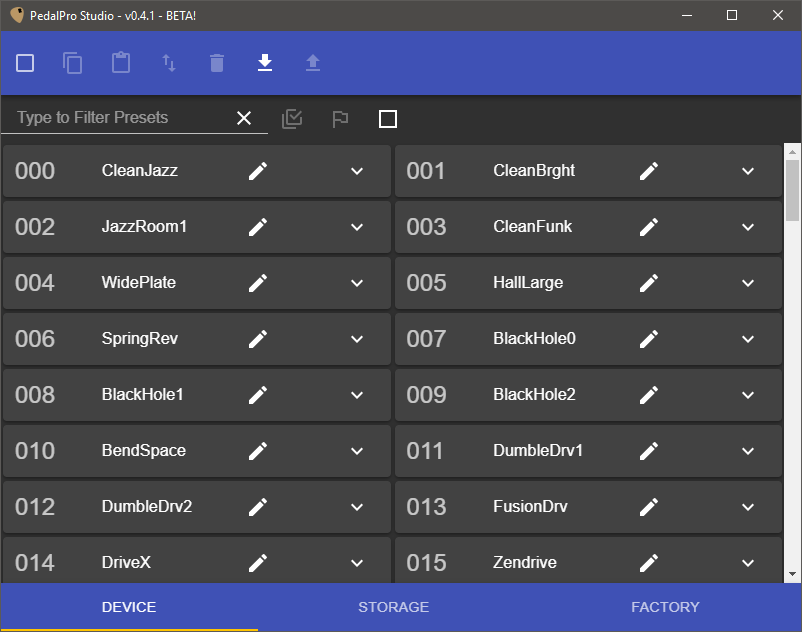

The PedalPro Studio program is a Preset editor for the [Vintage Revolution PedalPro multi-effects rack unit](https://www.vintage-revolution.com/pedalproex). The program support both the standard PedalPro as well as the PedalPro Ex version.

## Features of the PedalPro Studio program

* List, filter and order the presets in the PedalPro unit
* Save/Backup presets onto your computer and manage them in preset Storage Banks
* Restore presets from Factory or Storage Banks
* Edit all settings of the effects in a Preset
* The Guitar-signal-flow effects-list makes navigating the effects easier

## Supported PC platforms

* **Windows**
* **Apple Mac**
* _Linux_

Linux support is in the pipeline.

---

## Downloads

Latest version: **PedalPro Studio 0.4.1 _Beta_**

[Download for Windows](https://1drv.ms/u/s!AhOnTNbY2NaPiYx_dT0paBn_mBCYtA)

[Download for Mac](https://1drv.ms/u/s!AhOnTNbY2NaPiYx-CL2B8FrNcDgosA)

---

## Contribute

It would be very much appreciated if you find any bugs or have feature suggestions to record them [here](https://github.com/obiwanjacobi/PedalPro-Studio/issues/new/choose).

---

'Vintage Revolution', 'PedalPro' and 'PedalPro Ex' are trademarks owned by [Vintage Revolution](https://www.vintage-revolution.com/).

Copyright © 2017-2018 Jacobi Software