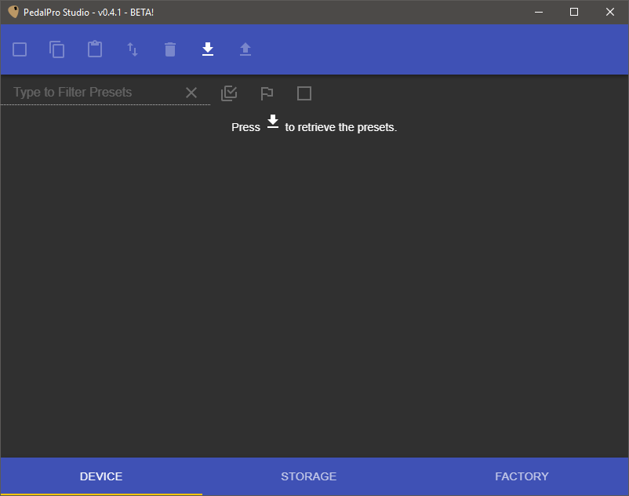

# User Manual

The PedalPro Studio application allows the user to remotely control the PedalPro or PedalPro-Ex from a PC connected by USB.

## Installing

The PedalPro Studio application is delivered using a setup program. Simply execute the setup and the application will install.

## Connecting

* Connect the PedalPro to the PC using the appropriate USB cable.
* Turn the PedalPro on and wait for it to boot.
* Press and hold the `EXIT (USB)` button on the PedalPro device until the display reports: _USB Remote Terminal_
* The PC should recognize the PedalPro at this point (ding!).

The application will try to reconnect when it loses connection with the device. So there is no harm in disconnecting and reconnecting the PedalPro device while the program is running.

## Application Concepts

* Initially all data is `download`-ed from the _source_ into the application.
* Only changed data is `upload`-ed from the application up to the _source_.
* Possible _sources_ are:
  * Device
  * Storage
  * Factory
* Changed presets are marked with a flag.
  * No Flag. The preset content has not changed -nor its position- compared to its source.
  * Open Flag (outline). The preset itself has not changed, but its position in the list has changed.
  * Flag (solid). The preset (content) has changed compared to its source. The position in the list may have also changed.
  * Garbage Can. The preset will be deleted - or overwritten with `{empty_ps}`.
* All changes remain in memory until an `upload` is performed.

---

## Device

Downloading here will contact the connected PedalPro device over USB and request all its presets. By default `{empty_ps}` presets are not displayed.

The presets are arranged in columns to assist in having a clear overview. Each preset is identified by its position and its name.

A preset item can be expanded by pressing the **V** button and will reveal a small pane that contains controls to

* Edit the preset's name.
* Move the preset up or down in the list, swapping places with the preset that was in that position previously.
* Mark the preset as deleted.

Each preset in the list also has an edit button (pencil) that brings up the effects editor.

Clicking on the position number of the preset item, selects the preset and additional functions become available in the toolbar.

### Device Toolbar

* Select All. Selects all presets. When there are changed presets (flag) than it also selects those. Press the button multiple times to cycle through, changed, selected and none.
* Copy. If any preset is selected, this button will copy them to the clipboard.
* Paste. Brings up the Device Preset Paste form when there presets on the clipboard.
* Move Presets. Brings up the Device Preset Move form when there are any selected presets.
* Delete Presets. Marks all selected presets to be deleted. The preset is cleared and made `{empty_ps}` and a garbage can (with cross) icon is displayed.
* Download Presets. Retrieves all presets from the PedalPro(Ex) device. If any changes are not saved, you will be prompted.
* Upload Presets. Changed presets are sent to the device.

### Device Preset Search

* Filter by name or index. Type text to only show presets that have those characters in their name or type numbers to search by index. Press the `X` button to clear the filter.
* Only show selected presets.
* Only show changed presets.
* Also show `{empty_ps}` presets. By default `{empty_ps}` presets are not show.

### Device Preset Paste

The Paste form shows the presets on the clipboard on the left, the oprations that can be performed on them in the middle and a preview of the result on the right.

The `Remove after Paste` option will remove any selected preset on the clipboard from the clipboard after the paste operation (`OVERWRITE`) has finished. So you can select/unselect presets in the clipboard.

The paste operations are:

* Replace by Index. Matches the index of each selected preset on the clipboard and overwrites the preset in the device.
* Replace by Name. Matches the name of each selected preset on the clipboard and overwrites the preset in the device.
* Replace empty. Finds `{empty_ps}` presets to use as paste targets.

The Preview shows the potential results of the selected paste operation. Each preset item is flagged if the original is changed.

### Device Preset Move

The Move form allows you to reorder the presets in the PedalPro(Ex) device.

Based on the selected presets it allows you to insert or swap them relative to a target preset. Again there is a preview to see the result of the operation.

---

## Storage

Downloading here will load the storage banks from the file system of the PC. Note that this is automatically done at startup.

After a fresh install, there are no banks and no presets shown. Press the `+` button to add a storage bank - and give it a proper name.

A storage bank is a named collection of presets. On the PC it is represented as folder on the file system. Presets can only be copeied into a storage bank from other sources - including other storage banks.

To view the presets in a storage bank, the bank has to be selected. When multiple storage banks are selected all their presets are shown.

As with the Device view, the presets here also expand and show the same controls - they behave the same too.

### Storage Toolbar

* Select All. Selects all presets. When there are changed presets (flag) than it also selects those. Press the button multiple times to cycle through, changed, selected and none.
* Copy. If any preset is selected, this button will copy them to the clipboard.
* Paste. Brings up the Storage Preset Paste form when there presets on the clipboard.
* Delete Presets. Marks all selected presets to be deleted. The preset is marked with a garbage can (with cross) icon.
* Download Presets. Retrieves all presets from the PedalPro(Ex) device. If any changes are not saved, you will be prompted.
* Upload Presets. Changed presets are sent to the device.

### Storage Preset Search

* Filter by name or index. Type text to only show presets that have those characters in their name or type numbers to search by index. Press the `X` button to clear the filter.
* Only show selected presets.
* Only show changed presets.

### Storage Preset Paste

The Paste form for storage is basically the same as for device. Only the operations are replaced by a bank selection - the destination of the pasted presets. New presets will always be appended to the end of the list.

---

## Factory

Opening the Factory tab brings up the factory presets for the connected device. The PedalPro has different factory presets from the PedalPro-Ex.

Presets here can be selected and copied onto the clipboard to past them back into the device, thus restoring factory presets one at a time.

### Factory Toolbar

* Select All. Selects all presets. When there are changed presets (flag) than it also selects those. Press the button multiple times to cycle through, changed, selected and none.
* Copy. If any preset is selected, this button will copy them to the clipboard.

### Factory Preset Search

* Filter by name or index. Type text to only show presets that have those characters in their name or type numbers to search by index. Press the `X` button to clear the filter.
* Only show selected presets.

---

## Effects

After the edit button is pressed on a preset, the effects editor is shown. At the top the preset name is displayed. 

On the left is the cancel `X` button - no changes will be saved to the preset and the effects editor is closed. On the right there is a `SAVE` button that will apply the changes to the preset. Note that the preset itself is still in memory and an upload must be performed to push it to the devices -or- save it to disk. The gear button `*` opens up a side pane with the preset control settings explained below.

On the left of the main window is the guitar siganl path; top to bottom. Each effect is listed and a switch indicates if it is enable/active in this preset -or not.

Some effects have multiple options like Filters and PreAmp, while others are a simple on/off toggle, like Boost and Volume.

Clicking on an effect in the list on the left, selects it and displays its settings in the main view. Again some are very simple, other not so much.

Click on the individual options when an effects is more complex. Each option will bring up its own settings.

Refer back to the original PedalPro(Ex) manual for detailed information on the effects and their settings.

### Compressor

Click the toggle switch to turn on or off.

### Filters (pre)

* Filter 1. Click the toggle switch to turn on or off.
* Filter 2. Click the toggle switch to turn on or off.

When both filters are on they are in parallel.

### Boost

Click the toggle switch to turn on or off.

### Distortion (standard)

Click the toggle switch to turn on or off.

### PreAmp (ex)

Click the toggle switch to turn on or off.
When on, the following options become available.

* Emphasis. Always on when the PreAmp is on.
* Distortion (diode). Click the toggle switch to turn on or off.
* Distortion (jfet). Click the toggle switch to turn on or off.
* Fuzz. Click the toggle switch to turn on or off. When on, will switch off both Distortion options.
* Equalizer. Always on when the PreAmp is on.

### Voltage Controlled Amplifier

Click the toggle switch to turn on or off.

### Phaser

Click the toggle switch to turn on or off.
The phaser will be in the Left audio channel.

### Filters (post)

* Filter 1. Click the toggle switch to turn on or off. Filter 1 will be in the Left audio channel.
* Filter 2. Click the toggle switch to turn on or off. Filter 2 can either be in the Left or Right audio channel. Use the left or right toggle switch for this.

### Modulation

* Chorus. Click the toggle switch to turn on or off.
* Flanger. Click the toggle switch to turn on or off.
* Vibe. Click the toggle switch to turn on or off.

Only one of these options can be active at the same time.

### Delay

Click the toggle switch to turn on or off. The Delay can either be in the Left or Right audio channel. Use the left or right toggle switch for this.

### Digital Delay and Reverb (ex)

Click the toggle switch to turn on or off.
Note that some Delay/Reverb Modes have additional settings.

### Aux

* Pedals. Click the toggle switch to turn on or off.
* Rack. Click the toggle switch to turn on or off. Also known as Mixer.

Only one of these options can be active at the same time.

### Volume

Click the toggle switch to turn on or off.

### Noise Gate

Click the toggle switch to turn on or off.

### Preset Control

Click the 'gear' button in the toolbar to bring up the Preset Control options:
Tap Tempo, Midi Routing and Amp Switches.

